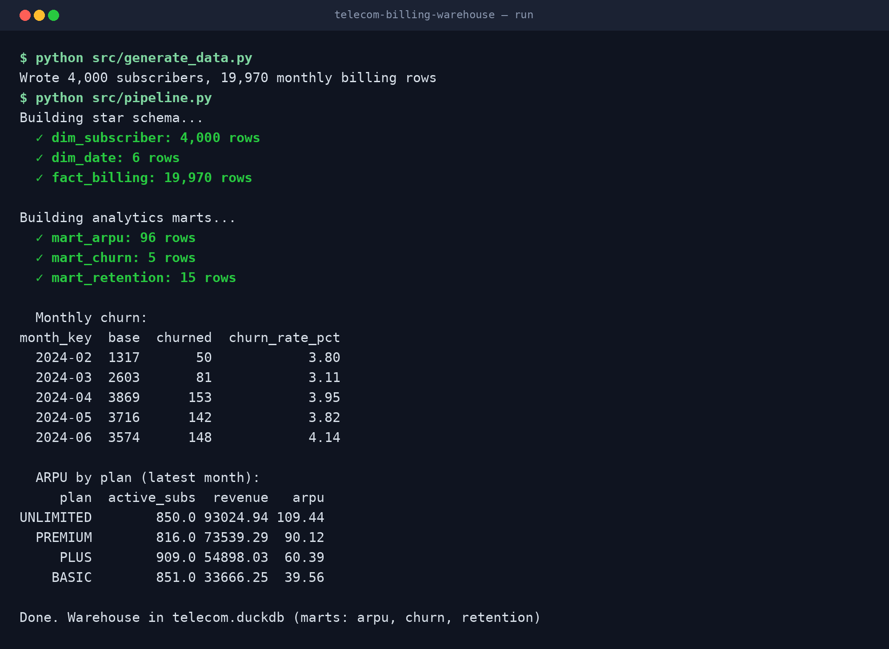
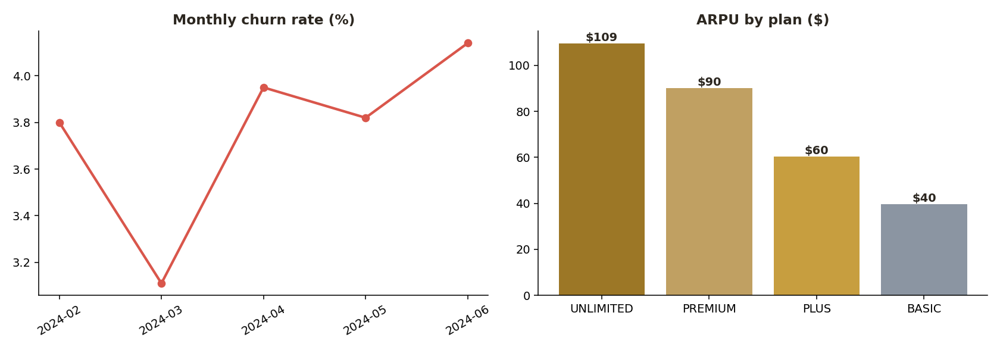

# Telecom Billing & Churn Warehouse (SQL)

A **star-schema data warehouse** for telecom billing that turns raw subscriber, CDR, and billing data into **ARPU, churn, and retention** marts — the analytics I built on Oracle for a telecom's customer-care and marketing teams. Built here with **DuckDB + SQL** so it runs anywhere.

> Portfolio/demo project on synthetic data. No proprietary data.

## Star schema

```
        dim_subscriber            dim_date
        (plan, region,            (month, year)
         signup cohort)                │
                └────────┐   ┌─────────┘
                         ▼   ▼
                   ┌──────────────────┐
                   │   fact_billing   │   grain: 1 subscriber × month
                   │ base · addons ·  │   measures: charges, active flag
                   │ total · active   │
                   └──────────────────┘
                            │
            ┌───────────────┼────────────────┐
            ▼               ▼                ▼
        mart_arpu       mart_churn      mart_retention
```

## What it demonstrates

- **Dimensional modeling** — star schema (dimensions + fact) at a clear grain
- Analytics SQL with **window functions** (`LAG` for churn), filtered aggregates, cohort retention
- Business marts: **ARPU** by plan/region, **monthly churn rate**, **retention curves**
- End-to-end build orchestrated from Python (`.sql` files run in order)

## 🔴 Live run & results

Building the star schema and analytics marts, with monthly churn and ARPU:



Churn trend and ARPU by plan:



## Tech

`SQL` · `DuckDB` (Oracle/Snowflake-portable) · `Dimensional Modeling` · `Window functions` · `Python`

## Quickstart

```bash
pip install -r requirements.txt
python src/generate_data.py     # subscribers + monthly billing
python src/pipeline.py          # builds star schema + marts, prints churn & ARPU
```

## Project layout

```
telecom-billing-warehouse/
├── README.md
├── requirements.txt
├── sql/
│   ├── 01_star_schema.sql   # dims + fact
│   └── 02_analytics.sql     # ARPU / churn / retention marts
└── src/
    ├── generate_data.py     # synthetic subscribers + billing
    └── pipeline.py          # runs the SQL build + reports
```

## Production notes

Originally built on **Oracle 11g** with **Informatica / SSIS** ETL loading star/snowflake models with **SCD Type 1 & 2**, tuned with indexes and partitions to keep loads inside the nightly window.

## 🧾 Full tech stack — Cox Communications — Data Warehouse Engineer

Every tool from this role on my resume (verbatim):

> Oracle 11g · SQL Server · Informatica PowerCenter · SSIS · PL/SQL · T-SQL · Star & Snowflake Schema · SCD Type 1 & 2 · Call Detail Records (CDR) · UNIX Shell Scripting · Control-M · Agile

---
Built by **Sai Karna** · [portfolio](https://saik85.github.io/) · Lead Data Engineer
